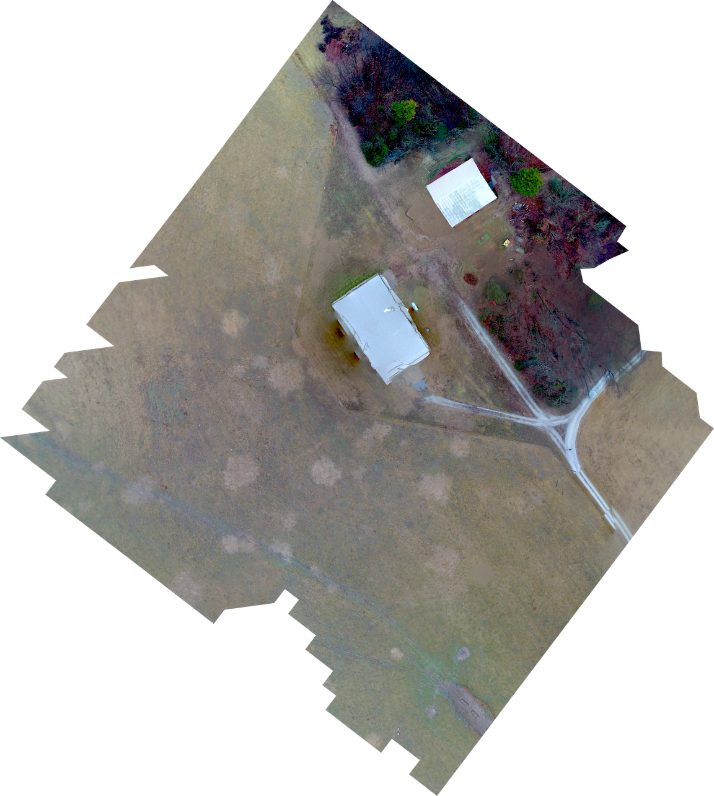

# Photogrammetry Part 2 Material

A simple aerial survey of farmland in Decatur, AR for the May 2017 [Servo Magazine](http://www.servomagazine.com). All of the processing was accomplished with [Open Drone Map](http://opendronemap.github.io/odm/). 

* **raw_photos** - All of the raw photos from the flight. You can cut out some to speed processing if you desire.
* **textured_mesh** - My results from ODM. Open the object file with something like MeshLab to see the model.
* **orthophoto** - Orthophoto result from ODM. Georeferenced and can be viewed with any image viewer or GIS software.
* **gcp_files** - Ground control points I used in my inversion.
* **undistory.py** - Modified script from [@wildintellect](https://github.com/wildintellect)'s [repository](https://github.com/wildintellect/lenscorrection). Hacked up to work with my Faux Pro camera.